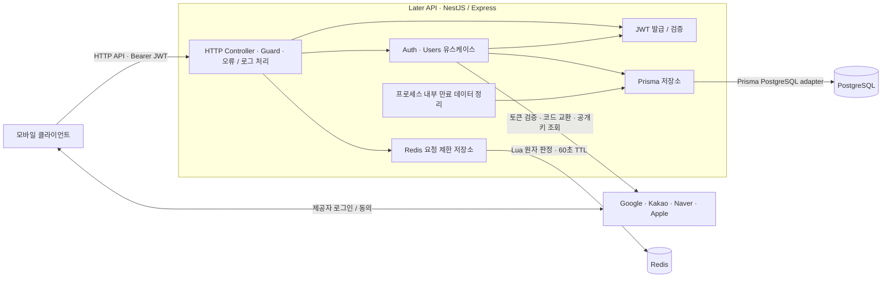

# Later 서비스 구성

현재 `feat/auth`에서 구현된 서버 구성을 기준으로 한다. 모바일은 연결 상대를 나타내며 이번 작업에서 구현·검증하지 않았다. 운영 서버 주소, 인스턴스 수, 클라우드 사업자와 실제 배포 상태는 확인하지 않았다. 서비스 규칙은 [서비스 정책](service-policy.md), 개선 과제는 [Auth 운영 점검](auth-operational-review.md)을 따른다.

## 전체 연결

JWT 검증 후 보호 API는 PostgreSQL에서 회원 존재 여부도 확인한다. 구성도에는 코드로 연결된 구성 요소를 표시했다. 로드밸런서·TLS 종료 프록시·별도 worker·관리형 DB는 현재 배포 근거가 없어 포함하지 않았다.

## 구성 요소와 데이터 책임

| 구성          | 현재 역할                                                                                                            | 근거                                                                                                                                                                   |
| ------------- | -------------------------------------------------------------------------------------------------------------------- | ---------------------------------------------------------------------------------------------------------------------------------------------------------------------- |
| API           | NestJS 12 / Express HTTP 서버. 기본 포트3000, `PORT`로 변경. auth/users 모듈, 공통 오류 필터와 요청 로그             | [main.ts](../apps/api/src/main.ts), [AppModule](../apps/api/src/app.module.ts)                                                                                         |
| PostgreSQL    | 회원, 소셜 연결, 로그인 세션, Refresh Token 해시, Apple/Naver 로그인·연동 시도 저장                                  | [Prisma schema](../apps/api/prisma/schema.prisma), [PrismaModule](../apps/api/src/database/prisma.module.ts)                                                           |
| Redis         | 인스턴스 간 공유 인증 요청 제한. 회원·세션 저장이나 일반 캐시/큐 용도로 사용하지 않음                                | [요청 제한 Module](../apps/api/src/auth/auth-rate-limit.module.ts), [Redis 저장소](../apps/api/src/auth/infrastructure/rate-limit/redis-auth-rate-limit.repository.ts) |
| 소셜 제공자   | Google/Apple ID Token 검증, Kakao Access Token 확인, Naver 서버 코드 교환·프로필 확인                                | [AuthModule](../apps/api/src/auth/auth.module.ts), [소셜 로그인 흐름](social-login-process.md)                                                                         |
| JWT           | API 프로세스에서 비밀키로 발급·검증. 자체 Access Token을 Redis에 저장하지 않음                                       | [AccessTokenModule](../apps/api/src/auth/access-token.module.ts), [토큰 안내](../apps/api/src/auth/infrastructure/tokens/README.md)                                    |
| 정리 스케줄러 | 각 API 프로세스 내부에서 시작 즉시와5분마다 정리. 최대10배치·배치당500개와 배치 사이10초 예산. 별도 작업 서버 없음   | [정리 안내](../apps/api/src/auth/infrastructure/cleanup/README.md)                                                                                                     |
| API 명세      | 같은 API에서 `/docs` Swagger UI와 `/docs-json` 제공                                                                  | [OpenAPI 설정](../apps/api/src/common/openapi/setup-openapi.ts), [명세 안내](openapi.md)                                                                               |
| 관측          | 자체 요청 로그와 Nest Observe instrumentation 코드가 존재. Observe 설정은 placeholder이며 실제 수집·보존 상태 미확인 | [AppModule](../apps/api/src/app.module.ts)                                                                                                                             |

기존 PostgreSQL `AuthRateLimitBucket` 테이블과 migration은 보존되어 있지만 새 요청의 제한 판정에는 사용하지 않는다. 기존 만료 행은 정리 대상이다.

## 주요 처리 흐름

1. **소셜 로그인:** 요청 제한을 Redis에서 확인하고 제공자 자격 증명을 검증한다. `(provider, subject)`로 회원을 조회·생성한 뒤 PostgreSQL에 세션·Refresh Token 해시를 저장하고 자체 JWT와 Refresh Token을 반환한다. Apple/Naver의 일회성 시도는 PostgreSQL에서 관리한다.
2. **보호 API:** JWT를 검증하고 PostgreSQL에서 회원 존재를 확인한다. 본인 소셜 목록 조회·연동·탈퇴 유스케이스로 연결한다. 연동은 기존 회원에 검증된 제공자 계정을 추가한다.
3. **갱신·로그아웃:** Redis 요청 제한 뒤 PostgreSQL 세션/토큰 상태를 검사하고 회전 또는 폐기한다. 갱신 시 새 JWT를 발급한다.
4. **탈퇴·만료 정리:** 탈퇴는 회원과 연결된 데이터를 PostgreSQL cascade로 삭제한다. 만료 정리는 API 내부 스케줄러가 배치별 트랜잭션으로 반복 수행한다. AuthSession(expiresAt,id) 인덱스가 정리를, Apple/Naver(ownerUserId) 인덱스가 탈퇴 시 소유자 조회를 지원한다. Redis 제한 키는 TTL로 자동 삭제되어 해당 정리 작업에 의존하지 않는다.

수명·제한 횟수·재사용 탐지·삭제 예외는 중복 정의하지 않고 [서비스 정책](service-policy.md)을 따른다.

Google은 같은 API 프로세스의 OAuth2Client factory를 사용한다. 인증서 HTTP에5초 timeout·자동 retry0을 적용하고 응답 검증을 통과해야 SDK cache에 저장한다. JWT 검증은 SDK가 수행한다. 인증서 장애는503으로 분류한다. [통신 경계 코드](../apps/api/src/auth/infrastructure/google/google-oauth-client.ts)를 기준으로 하며 외부 제공자 전역 동시성 제한/회로 차단기는 아직 없다.

## 로컬 구성과 환경 경계

- 루트 [compose.yaml](../compose.yaml)은 **Redis만** 실행한다. API와 PostgreSQL을 함께 띄우는 전체 Compose 구성은 없다.
- Redis는 localhost6379(환경변수로 변경), 이미지 `redis:8-alpine`, maxmemory64MB/noeviction, 컨테이너128MB 한도, healthcheck와 재시작 설정을 사용한다. RDB/AOF 영속화는 꺼져 있어 재시작하면 현재 제한 창이 초기화된다. [Redis 실행 안내](redis.md)를 따른다.
- PostgreSQL 연결은 `DATABASE_URL`, Redis 연결은 `REDIS_URL`로 주입한다. 개발 DB 이름은 `later_dev`, 통합 테스트는 `later_test`와 localhost Redis DB15다. 실제 URL·비밀번호는 문서나 Git에 기록하지 않는다.
- 소셜 제공자 식별자·Naver callback/app return/bridge key·JWT 비밀키·신뢰 프록시 CIDR은 [ENV 예시](../apps/api/.env.example)를 기준으로 별도 설정한다. 예시 callback 주소를 배포 완료의 근거로 해석하지 않는다.
- 테스트용 임시 PostgreSQL/Redis는 검증 때만 실행한 자원이며 지속 실행되는 서비스 구성 요소가 아니다. Docker 설정 검증과 실제 임시 Redis 검증은 수행했지만 Docker 컨테이너 기동·운영 Redis 적용은 확인하지 않았다.

## 운영 적용 시 확인할 구성

API 인스턴스를 늘리면 동일 환경의 PostgreSQL과 Redis를 공유해야 요청 제한·세션 상태가 일관된다. 현재 인스턴스 수나 고가용성 구성은 정해진 것으로 기록하지 않는다.

운영 프록시를 둔다면 TLS 종료·전체 트래픽 제한과 정확한 `TRUSTED_PROXY_CIDRS`를 설정한다. `/0`과 전체 mapped IPv4를 포함하는 IPv6 CIDR은 시작 시 거부한다. 운영 Redis의 private network·ACL·TLS·용량/장애 감시, PostgreSQL 연결 예산·백업, 의존 저장소 readiness와 관측 설정은 별도 확인 대상이다. Redis 장애는 인증 요청을 실패시키며 PostgreSQL fallback을 하지 않는다.

## 문서 유지 기준

API 모듈/외부 의존성, 저장소 역할, 데이터 흐름, 배포·네트워크·백그라운드 작업 또는 관측 구성이 바뀌면 **같은 작업에서 이 문서를 갱신**한다. 구성도·표·환경 경계·근거 링크를 실제 코드/설정과 대조하고 구현 완료·계획·배포 미확인을 구분한다. 정책 변경이 함께 있으면 [서비스 정책](service-policy.md)도 갱신한다.
