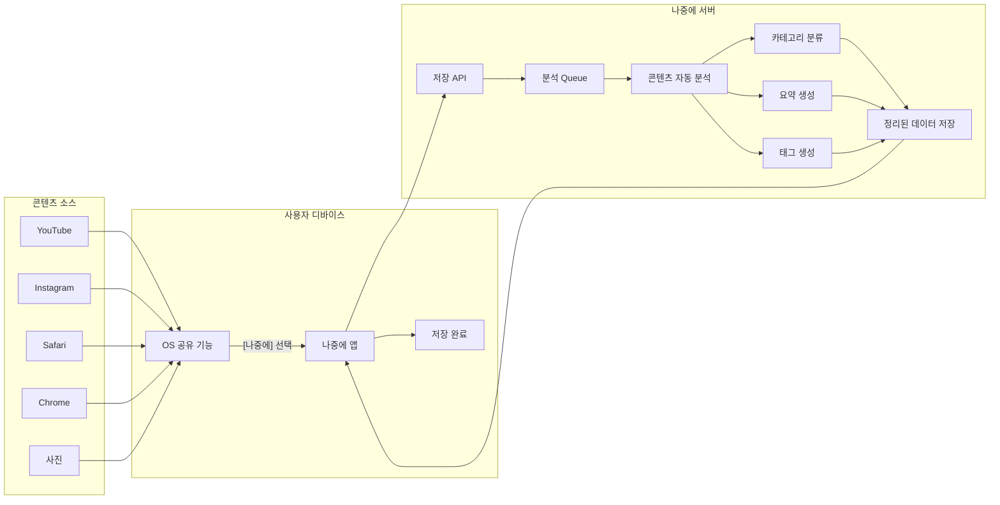
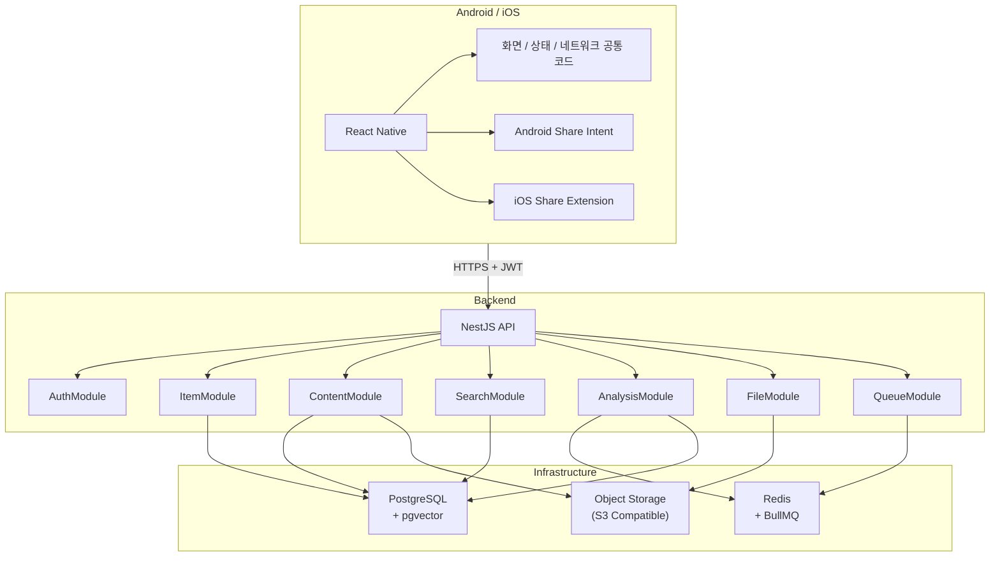
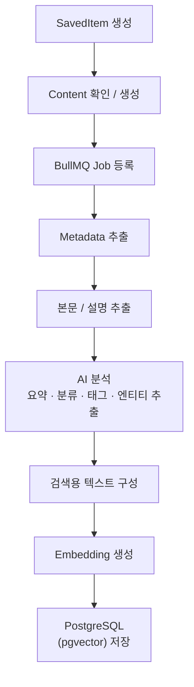

# 1. 문서 목적

이 문서는 B2C 서비스 “나중에(Later)”의 제품 방향과 구현 구조를 한데 정리한 설계 초안이다. 초기 개발 시 범위를 통제하고, 모바일·백엔드·데이터·검색 구조가 서로 어긋나지 않도록 기준점으로 사용한다.

<aside>

**핵심 정의 |** 사용자가 웹, 영상, 이미지, 텍스트를 “공유 기능”을 통해 저장, 이후 자연어로 검색하면 다시 찾을 수 있게 하는 서비스

</aside>

# 2. 제품 개요

| 항목 | 정의 |
| --- | --- |
| 서비스명 | 나중에 (Later) |
| 대상 | 일반 소비자 사용자 |
| 핵심 문제 | 인스타·유튜브·브라우저·메신저·스크린샷 등에 흩어진 “나중에 볼 것”을 다시 찾지 못함 |
| 핵심 가치 | 저장 과정 최소화 + 자동 정리 + 의미 기반 재검색 |
| 주요 플랫폼 | Android/IOS |
| 백엔드 | NestJS/TypeScript |
| 모바일 | React Native 기반, OS별 공유기능은 네이티브 연동 |
| 검색 | 키워드 + 메타데이터 + 벡터 의미 검색의 Hybrid Search |

# 3. 핵심 사용자 경험

서비스의 UX 는 “공유 →  나중에 → 끝”을 기준으로 설계한다. 저장 시 사용자가 폴더, 태그, 제목을 직접 입력하도록 요구하지 않는다.



## 3.1 저장 시

- 앱을 직접 열지 않아도 OS 공유 메뉴에서 저장이 가능해야 한다.
- 저장 요청은 서버가 즉시 수락하고, AI 분석 완료를 기다리지 않는다.
- 저장 직후에는 “저장 완료”만 보여주고 분석은 비동기로 진행한다.

## 3.2 다시 찾을 때

<aside>

“저번에 성수에서 가려고 했던 카레집 뭐였지?”

“몇 달 전에 봤던 백엔드 성능 개선 글”

“예전에 저장한 책상 밑 멀티탭 거치대”

</aside>

정확한 제목이나 태그를 기억하지 못해도 저장 당시 콘텐츠의 의미와 메타데이터를 기반으로 검색되어야 한다.

# 제품 설계 원칙

1. 저장 비용 최소화 — 저장 시 사용자의 분류 작업을 최대한 제거한다.
2. 모바일은 얇게 — 모바일 앱은 공유받기, 업로드, 목록, 검색, 상세, 알림?에 집중한다.
3. 무거운 처리는 서버에서 — 크롤링, 본문 추출, OCR, AI 분석, 임베딩, 검색은 NestJS/Worker에서 수행한다.
4. 개인데이터 우선 — 사용자가 저장한 사실, 개인 메모, 이미지, 컬렉션은 사용자 단위로 완전히 격리한다.
5. 공개 데이터는 재사용 — 동일한 공개 URL은 공통 Content로 중복 분석 비용을 줄인다.
6. 처음부터 과설계 하지 않기 — MVP는 PostgresSQL + pgvector + Redis/BullMQ 정도로 시작한다.

# 5. 전체 시스템 구조



# 6. 모바일 앱 구조

Android와 iOS를 동시에 제공하므로 React Native를 기본으로 사용한다. 서비스 핵심인 “OS공유 메뉴에서 “나중에”로 보내기는 플랫폼별 네이티브 기능을 연결한다.

| 영역 | Android | iOS |
| --- | --- | --- |
| 공유 수신 | ACTION_SEND / Share Intent | Share Extension |
| 공통 UI | React Native | React Native |
| API 통신 | 공통 TypeScript 코드 | 공통 TypeScript 코드 |
| 상태/캐시 | TanStack Query / 필요 시 Zustand | 동일 |
| 네이티브 분리 | 필요한 부분만 Kotlin | 필요한 부분만 Swift/Extension |

## 6.1 모바일의 책임

- 로그인 및 토큰 관리
- 공유 데이터 수신 (URL, 텍스트, 이미지)
- 서버 업로드
- 저장 목록 및 상세 화면
- 자연어 검색 UI
- 분석 상태 표시 (PROGRESSING / READY / FAILED)
- 추후 알림 및 Resurface 표시

# 7. NestJS 백엔드 구조

```

src/
├─ auth/
├─ users/
├─ items/
├─ contents/
├─ analysis/
├─ search/
├─ queue/
├─ storage/
└─ common/
```

| 모듈 | 책임 |
| --- | --- |
| AuthModule | JWT/Refresh Token, 현재 사용자 식별 |
| ItemModule | 사용자의 저장 기록 생성·조회·삭제 |
| ContentModule | 공통 콘텐츠 본문/메타데이터 관리 |
| AnalysisModule | 본문 추출, 요약, 태그, 엔티티, 임베딩 생성 |
| SearchModule | 키워드/필터/백터 검색 조합 |
| QueueModule | BullMQ 기반 비동기 분석 작업 |
| StorageModule | 이미지/파일 업로드 및 접근 제어 |

# 8. 멀티유저 데이터 모델

가장 중요한 모델링 원칙은 “실제 콘텐츠(Content)”와 “사용자가 저장한 기록(SavedItem)”을 분리하는 것이다.

```
User A ─ SavedItem A ─┐
                       ├─ Content #123
User B ─ SavedItem B ─┘
```

## 8.1 주요 엔티티

| 엔티티 | 주요 필드 | 설명 |
| --- | --- | --- |
| User | id, email, createdAt | 사용자 계정 |
| Content | id, type, canonicalUrl, title, body, summary, embedding, visibility, status | 분석된 실제 콘텐츠 |
| SavedItem | id, userId, contentId, memo, isFavorite, createdAt | 특정 사용자가 콘텐츠를 저장한 개인 기록 |
| Collection | id, userId, name | 사용자별 컬렉션 |
| CollectionItem | collectionId, savedItemId | 컬렉션-저장항목 연결 |
| Asset | id, userId, savedItemId, StorageKey, mimeType | 개인 이미지/파일 |

## 8.2 공개 URL과 개인 데이터

| 종류 | 공유 여부 | 처리 |
| --- | --- | --- |
| 공개 웹 URL | 공통 Content 재사용 기능 | canonical URL 기준 중복 제거 및 분석 재사용 |
| 개인 텍스트 | 공유 금지 | ownerUserId 또는 SavedItem 전용 Content로 분리 |
| 사용자 이미지/스크린샷 | 공유 금지 | 사용자 소유 Asset로 저장 |
| 사용자 메모/태그 | 공유 금지 | SavedItem 하위 개인 데이터 |

# 9. URL 저장 처리 흐름

1. 모바일이 공유받은 URL을 POST /items 로 전송한다.
2. NestJS는 JWT에서 현재 userId를 추출한다. 클라이언트가 UserId를 임의로 넘기지 않는다.
3. URL을 정규화하여 canonical URL을 만든다.
4. 동일한 공개 Content가 이미 존재하는지 검색한다.
5. 없으면 PROCESSING 상태의 Content를 생성하고 분석 Queue에 등록한다.
6. 현재 사용자의 SavedItem을 즉시 생성한다.
7. API는 분석 완료를 기다리지 않고 성공 응답을 반환한다.
8. Worker가 URL metadata/본문/AI 분석/embedding을 생성한 뒤 Content를 READY로 갱신한다.

```
POST /items
{ "type": "URL", "value": "https://example.com/..." }

→ 201 Created
{ "id": "saved_xxx", "status": "PROCESSING" }
```

# 10. 비동기 분석 파이프라인



AI는 서비스 자체가 아니라 정리와 검색 품질을 높이는 보조 계층으로 사용한다. 초기에는 요약, 카테고리, 태그, 장소/제품/주제 엔티티 추출 정도로 제한한다.

# 11. 벡터 검색 구현 방식

벡터 검색은 사용자가 저장 당시 제목을 정확히 기억하지 못해도 “의미가 비슷한 콘텐츠”를 찾기 위한 기능이다. 임베딩 모델이 텍스트를 숫자 벡터로 변환하고, PostgreSQL 의 pgvector가 벡터 간 거리를 계산한다.

```mermaid
flowchart TB

    subgraph SAVE["저장 시"]
        A["제목 + 요약 + 태그 + 엔티티"]
        B["Embedding Model"]
        C["Vector<br/>[0.013, -0.221, 0.087, ...]"]
        D["PostgreSQL<br/>VECTOR 컬럼"]

        A --> B
        B --> C
        C --> D
    end

    subgraph SEARCH["검색 시"]
        E["사용자 검색어<br/>“전에 봤던 성수 데이트 카레집”"]
        F["Embedding Model"]
        G["Query Vector"]
        H["pgvector<br/>Cosine Distance"]
        I["현재 사용자의 SavedItem 범위에서<br/>유사도가 가까운 순으로 반환"]

        E --> F
        F --> G
        G --> H
        H --> I
    end

    D -. "저장된 Vector와 비교" .-> H
```



## 11.1 사용자 격리 검색

```sql
SELECT
  si.id,
  c.title,
  1 - (c.embedding <=> $1::vector) AS similarity
FROM saved_items si
JOIN contents c ON c.id = si.content_id
WHERE si.user_id = $2
ORDER BY c.embedding <=> $1::vector
LIMIT 20;
```

벡터 인덱스가 전체 Content에 존재하더라도 사용자에게 반환할 결과는 반드시 해당 사용자의 SavedItem 범위로 제한해야 한다.

## 11.2 검색용 임베딩 텍스트

제목 하나만 임베딩하기보다 검색에 도움이 되는 정보를 묶어 하나의 검색 문맥으로 만든다.

```
제목: 서울 브이로그 #17
요약: 성수동 일본식 카레집 방문 후 서울숲 데이트
카테고리: 맛집, 데이트
태그: 성수, 카레, 서울숲
장소: 성수동, 서울숲
```

# 12. Hybrid Search

최종 검색은 벡터 유사도 하나에만 의존하지 않고, 키워드, 날짜, 장소, 카테고리 같은 명시적 조건과 결합한다.

```
사용자 입력: “작년에 저장한 성수 맛집”

1) userId = 현재 사용자
2) 저장 시점 = 작년
3) keyword/entity = 성수
4) vector similarity = 맛집 의미
5) 점수 결합 후 정렬
```

# 13. API 초안

| Method | Endpoint | 역할 |
| --- | --- | --- |
| POST | /auth/login | 로그인 |
| POST | /auth/refresh | Access Token 갱신 |
| POST | /items | URL/텍스트/이미지 저장 |
| GET | /items | 현재 사용자의 저장 목록 |
| GET | /items/:id | 저장 상세 조회 |
| DELETE | /items/:id | 저장 삭제 |
| GET | /search?q=… | Hybrid/벡터 검색 |
| POST | /collections | 개인 컬렉션 생성 |
| GET | /collections | 개인 컬렉션 목록 |

# 14. 보안 및 개인정보 원칙

- 모든 사용자 소유 데이터 조회는 인증 토큰의 userId를 기준으로 제한한다.
- 클라이언트가 요청 Body/Query로 전달한 userId를 신뢰하지 않는다.
- 개인 텍스트, 이미지, 메모는 다른 사용자와 dedup 또는 공유하지 않는다.
- Object Storage 파일은 공개 URL로 노출하지 않고 소유권 확인 후 Presigned URL 등을 발급한다.
- 벡터 검색에서도 사용자 범위 조건을 항상 적용한다.
- 향후 PostgreSQL Row Level Security(RLS)를 추가 방어선으로 검토한다.

# 15. MVP 범위

<aside>

**MVP 목표** | “Android/iOS 에서 공유한 URL 을 저장하고, 나중에 자연어로 다시 찾을 수 있다.” 이 한문장이 동작하면 첫 버전은 성공이다.

</aside>

| 포함 | 제외/후순위 |
| --- | --- |
| 회원가입/로그인 | 복잡한 소셜 기능 |
| Android 공유받기 | 친구/팔로우 |
| iOS Share Extension | 공동 컬렉션 |
| URL 저장 | 위치 기반 추천 |
| 저장 목록/상세 | 가격 추적 |
| 비동기 metadata/논문 분석 | 브라우저 확장 프로그램 |
| Embedding 생성 | 고급 자동화 |
| 자연어 검색 | 과도한 AI 챗 인터페이스 |

# 16. 단계별 개발 순서

**Phase 1 · 핵심 저장 경로**
NestJS 인증 → POST /items → PostgreSQL 저장 → Android/iOS 공유 수신 PoC

**Phase 2 · 분석**
BullMQ → URL metadata/본문 추출 → 상태 PROCESSING/READY 관리

**Phase 3 · 의미 검색**
pgvector → embedding 생성 → 현재 사용자 SavedItem 범위 벡터 검색

**Phase 4 · 정리 UX**
AI 요약/태그/엔티티 → 검색 결과 카드 개선

**Phase 5 · 재발견**
Resurface: 오래된 저장물 다시 보여주기, 주간 다시 보기

# 17. 향후 확장 아이디어

- 자동 Collection: 맛집, 여행, 개발, 사고 싶은 것, 나중에 볼 것 등을 자동 분류
- Resurface: “3개월 전에 저장한 것”, “이번 주 다시 볼 것”처럼 잊힌 콘텐츠 재노출
- OCR 및 이미지 기반 저장: 스크린샷의 텍스트/제품/장소 분석
- 브라우저 Extension: PC에서 한 번에 저장
- 사용자 메모 및 사용자 태그
- 가족/친구 공유 컬렉션
- 검색 품질 개선: 키워드 + FTS + Vector + metadata reranking

# 18. 현재 결정된 기술 방향

| **영역** | **결정** |
| --- | --- |
| 서비스 유형 | 일반 사용자 대상 B2C 개인 저장/재검색 서비스 |
| Backend | NestJS + TypeScript |
| Mobile | React Native로 Android/iOS 동시 제공 |
| Android 공유 | Share Intent |
| iOS 공유 | Share Extension |
| DB | PostgreSQL |
| Vector | pgvector |
| Queue | Redis + BullMQ |
| 파일 | S3 compatible object storage |
| AI 역할 | 요약·분류·태그·엔티티·Embedding |
| 멀티유저 핵심 | SavedItem(user-owned)과 Content(shared/cache)의 분리 |

# 19. 아직 정해야 할 사항

- React Native 프로젝트를 Expo Development Build 기반으로 시작할지 Bare React Native로 시작할지
- 초기 인증 방식(이메일/비밀번호, 소셜 로그인 등)
- URL 본문 추출 정책 및 지원 사이트 범위
- Embedding provider/model 및 비용 정책
- 개인 이미지 저장·보관 기간과 삭제 정책
- 서비스 이름 “나중에”의 실제 출시명/도메인/브랜드 결정

<aside>

**다음 설계 포인트**  구현에 들어가기 전 가장 먼저 검증할 것은 Android/iOS의 공유 수신 PoC와 “URL 저장 → 본문 추출 → embedding → 사용자 한정 검색”의 end-to-end 경로다.

</aside>

---